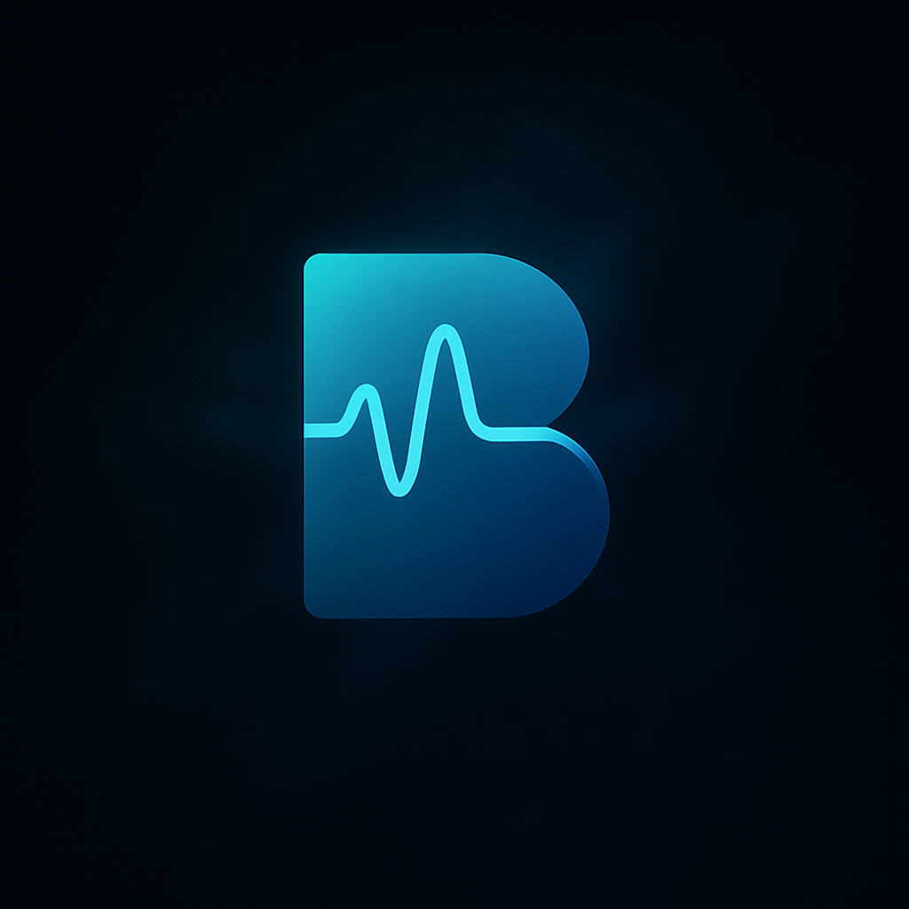

# 🎵 BackTune

<div align="center">
  
  <br><br>
  
  [](https://www.android.com)
  [](https://kotlinlang.org)
  [](https://developer.android.com/jetpack/compose)
  [](https://developer.android.com/training/dependency-injection/hilt-android)
</div>

## 🎨 About

BackTune is an Android application that enhances your YouTube viewing experience by allowing you to overlay relaxing ambient sounds on top of your favorite videos. Perfect for creating a more immersive and focused viewing experience.

### ✨ Features

- 🎥 YouTube video playback with background ambient sounds
- 🎵 Multiple ambient sound options (Rain, Waves, Forest, etc.)
- 🎚️ Independent volume control for background sounds
- 🌙 Modern dark theme UI
- 🔄 Background sound looping
- 🎨 Material 3 design with Jetpack Compose

## 🛠️ Tech Stack

- **Language:** Kotlin
- **UI Framework:** Jetpack Compose
- **Architecture:** MVVM
- **Dependency Injection:** Hilt
- **Video Player:** YouTube Android Player API
- **Audio Playback:** ExoPlayer
- **Navigation:** Navigation Compose
- **State Management:** StateFlow

## 🚀 Getting Started

### Prerequisites

- Android Studio Arctic Fox or newer
- Android SDK 26+
- Kotlin 1.9.0+
- Gradle 8.0+

### Installation

1. Clone the repository
```bash
git clone https://github.com/malik0011/BackTune-App.git
```

2. Open the project in Android Studio

3. Sync project with Gradle files

4. Run the app on your device or emulator

## 📦 Project Structure

## 🎨 UI/UX

- Modern dark theme design
- Smooth animations and transitions
- Intuitive sound selection interface
- Responsive layout for all screen sizes

## 🔄 Development Roadmap

- [ ] User authentication
- [ ] Save favorite sound combinations
- [ ] Custom sound upload
- [ ] Multiple sound mixing
- [ ] Offline mode
- [ ] Premium sound packs

## 🤝 Contributing

Contributions are welcome! Please feel free to submit a Pull Request.

1. Fork the project
2. Create your feature branch (`git checkout -b feature/AmazingFeature`)
3. Commit your changes (`git commit -m 'Add some AmazingFeature'`)
4. Push to the branch (`git push origin feature/AmazingFeature`)
5. Open a Pull Request

## 📝 License

This project is licensed under the MIT License - see the [LICENSE](LICENSE) file for details.

## 👥 Authors

- Ayan Malik - Initial work - [@malik0011](https://github.com/malik0011)

## 🙏 Acknowledgments

- YouTube Android Player API
- ExoPlayer
- Jetpack Compose
- Material Design 3

## 📫 Contact

Ayan Malik - [@malik0011](https://github.com/malik0011)

Project Link: [https://github.com/malik0011/BackTune](https://github.com/malik0011/BackTune-App)

---

<div align="center">
  Made with ❤️ by Ayan Malik
</div> 
